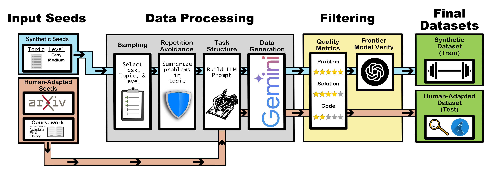

# VerifiableTPData
This repo provides the data pipeline for generating verifiable theoretical physics problems used in the paper [Fine-Tuning Small Reasoning Models for Quantum Field Theory](https://arxiv.org/abs/2604.18936) by N. Woodward et al.. 

The pipeline supports two generation modes:
- **Synthetic**: generate problems from a topic list using an LLM
- **Adapted**: reformat existing seed problem-solution pairs into a verifiable format

Every problem includes Python test cases. Problems pass through quality checking and independent solver verification before being added to the final dataset.

## Pipeline Overview



## Setup

### 1. Environment

```bash
conda create -n llmmath python=3.10
conda activate llmmath
pip install google-genai openai pyyaml tqdm numpy scipy sympy simplejson tenacity
```

### 2. API key

Create `api_keys/api_keys.json`:

```json
{
  "gemini_api_key": "YOUR_GEMINI_KEY",
  "openai_api_key": "YOUR_OPENAI_KEY"
}
```

(OpenAI key is only needed if you use GPT models for grading or solving.)

## Quick Start: Test the Pipeline

The fastest way to verify everything works is to run the test configs end-to-end. They use small problem counts and the trimmed `topics/QFT_test/` topic list.

### Synthetic test (5 easy QFT problems)

```bash
python scripts/run_pipeline.py --config configs/test/easy_test.yaml
```

This runs all 5 stages and writes verified problems to `synthetic_data/QFT_test/qft_easy_test/`.

### Adapted test (4 problems from MIT OCW seeds)

```bash
python scripts/run_pipeline.py --config configs/test/adapted_mit_ocw_test.yaml
```

Verified problems land in `adapted_data/QFT_adapted_test/mit_ocw_adapted_test/`.

### Test configs available

| Config | Mode | Notes |
|--------|------|-------|
| `configs/test/easy_test.yaml` | synthetic | 5 problems, easy prompt |
| `configs/test/medium_test.yaml` | synthetic | 5 problems, medium prompt |
| `configs/test/hard_test.yaml` | synthetic | 5 problems, hard prompt |
| `configs/test/adapted_mit_ocw_test.yaml` | adapted | 4 problems from MIT OCW seeds |

## Generating Your Own Data

### Option A: Synthetic generation

Create a config in `configs/` that points to a topic list and prompt:

```yaml
dataset_name: my_dataset
topic_list_path: topics/QFT_training/topic_list.json
system_prompt_path: prompts/QFT_training/easy_task_low_level_calc_prompt.txt
topic_name: QFT
num_problems: 100
level_split:
  Advanced Undergraduate: 0.25
  Graduate: 0.25
  Advanced Graduate: 0.25
  Post Graduate: 0.25
model: gemini-2.5-pro
seed: 42
num_workers: 16
task_config:
  tasks_min: 1
  tasks_max: 1
  tasks_dependent: false
```

Then run:

```bash
python scripts/run_pipeline.py --config configs/my_config.yaml
```

### Option B: Adapted generation (from seeds)

Place your seed YAML files under `seeds/<source_name>/<paper_or_doc>/matched_pairs.yaml`. Each pair should have `problem` and `solution` fields. Create a config:

```yaml
dataset_name: my_adapted_dataset
system_prompt_path: prompts/QFT_seed_processing/semi-synth-qft.txt
topic_name: QFT_adapted
seed_data_path: seeds/<source_name>
data_type: adapted_data
num_problems: 50
num_workers: 8
model: gemini-2.5-pro
```

Then run:

```bash
python scripts/run_pipeline.py --config configs/my_adapted_config.yaml
```

## Pipeline Script Options

```bash
python scripts/run_pipeline.py \
  --config configs/test/easy_test.yaml \
  --qc-threshold 0.8 \
  --solver-model gemini-2.5-flash \
  --max-k 3
```

| Flag | Default | Description |
|------|---------|-------------|
| `--config` | required | Generator config YAML |
| `--qc-threshold` | 0.8 | Min QC score (0-1) for problems to pass |
| `--solver-model` | gemini-2.5-flash | Model for independent verification |
| `--max-k` | 3 | Pass@k attempts (early stopping if first passes) |
| `--skip-generate` | — | Skip generation stage |
| `--skip-qc` | — | Skip QC + filter qc stages |
| `--skip-solver` | — | Skip solver + filter solver stages |

## Running Stages Individually

If you want finer control, run each stage manually:

```bash
# 1. Generate
python -m src.generator --config configs/test/easy_test.yaml
# (or for adapted)
python -m src.adapted_generator --config configs/test/adapted_mit_ocw_test.yaml

# 2. Quality check
python -m src.quality_check_problems --base_dir synthetic_data/QFT_test/qft_easy_test

# 3. Filter QC failures out
python -m src.filter qc synthetic_data/QFT_test/qft_easy_test --threshold 0.8

# 4. Independent solver verification
python -m src.indep_solver \
  --problems_dir synthetic_data/QFT_test/qft_easy_test \
  --model gemini-2.5-flash \
  --max_k 3

# 5. Filter solver failures out
python -m src.filter solver synthetic_data/QFT_test/qft_easy_test
```

## Resume / Re-running

Every stage is **resume-aware**:

- **Generate**: `num_problems` is the *total target*. Re-running with the same config does nothing if the target is already met. Increasing `num_problems` adds the difference.
- **QC**: Skips problems that already have enough gradings for the configured model.
- **Filter qc/solver**: Idempotent — only acts on top-level files; re-running on a clean dir is a no-op.
- **Indep solver**: Skips passed problems. If a problem failed at `max_k=1` and you re-run with `max_k=3`, it picks up from attempt 2.

This means you can safely interrupt and restart at any stage.

## Output Structure

After a complete pipeline run on `synthetic_data/QFT_test/qft_easy_test/`:

```
qft_easy_test/
├── p1.json, p4.json       # verified problems (the final dataset)
├── qc_failed/             # failed quality check
│   └── p2.json
├── solver_failed/         # passed QC but solver couldn't verify
│   └── p3.json
├── assignment.json        # tracks all assigned problem IDs
└── config.yaml            # snapshot of the config used
```

Each problem JSON contains:
- `problem_details` — statement, solution, code, test cases
- `quality_gradings` — multi-model QC scores
- `model_solutions` — solver attempts with `verifier_result`
- `indep_solver_results` — pass@k summary

## Repository Layout

```
src/                              # Pipeline modules
  generator.py                    # Synthetic generation
  adapted_generator.py            # Adapted from seed pairs
  quality_check_problems.py       # QC stage
  filter.py                       # qc/solver filter subcommands
  indep_solver.py                 # Independent verification (pass@k)
  generate_test_cases.py          # Auto test case generation
  solution_generator.py           # LLM solution generator (used by indep_solver)
  solution_grader.py              # Code execution + output comparison
  problem_processor_base.py       # Base class for solver/grader
  llm_client.py, parser.py        # Generator helpers
  io_utils.py, seed_loader.py     # Utilities
  topics.py, qc_data_structures.py
configs/
  inference_config.json           # Solver system prompts
  grading_config.json             # Grader config
  test/                           # Test configs (small, fast)
prompts/
  QFT_training/                   # Easy / medium synthetic prompts
  hard_prompts/                   # Hard synthetic prompts
  QFT_seed_processing/            # Adapted generation prompt
topics/
  QFT_test/                       # Trimmed test topics (12 topics)
  QFT_training/                   # Full QFT topic list
seeds/
  MIT_OCW/                        # Test seeds for the adapted pipeline
scripts/
  run_pipeline.py                 # End-to-end orchestration
genai.py                          # Gemini/OpenAI API wrapper
```

## Citation
```bibtex
@misc{woodward2026finetuningsmallreasoningmodels,
      title={Fine-Tuning Small Reasoning Models for Quantum Field Theory}, 
      author={Nathaniel S. Woodward and Zhiqi Gao and Yurii Kvasiuk and Kendrick M. Smith and Frederic Sala and Moritz Münchmeyer},
      year={2026},
      eprint={2604.18936},
      archivePrefix={arXiv},
      primaryClass={cs.LG},
      url={https://arxiv.org/abs/2604.18936}, 
}
```
